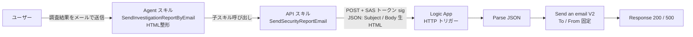

# Security Report Email Sender Plugin

Security Copilot の調査結果を HTML メールに整形し、Azure Logic App (Webhook) 経由で外部のメールアドレスに送信する **エージェント** です。Security Copilot 側はエージェント (GPT) として動作し、調査結果を HTML に整形してから API 子スキルで Logic App を呼び出します。HTML はそのまま (URL エンコードせずに) JSON ボディで受け渡します。

## 構成



| 項目 | 内容 |
|------|------|
| Security Copilot 側 | **Agent** (標準エージェント)。Agent スキル `SendInvestigationReportByEmail` が HTML 整形・送信をオーケストレート |
| 子スキル | API スキル `SendSecurityReportEmail` (Logic App の Webhook を呼び出す) |
| メール送信 | Office 365 Outlook コネクタの `Send an email (V2)` アクション |
| トリガー (Logic App) | HTTP Request (Webhook)、SAS 署名 (`sig`) で保護 |
| 認証 (API→Logic App) | SAS トークン。`sig` を ApiKey (QueryParams) で付与し、`api-version` / `sp` / `sv` は OpenAPI の単一値 enum で固定送信。将来 OAuth 2.0 対応予定 |
| 宛先 (To) / 送信元 (From) | Logic App 側で固定 (ARM パラメータ `mailTo` / `mailFrom`) |
| メッセージ | `Subject` / `Body` を JSON で受け渡し。`Body` は HTML をそのまま (URL エンコードせずに) 渡す |

## ファイル

| ファイル | 説明 |
|----------|------|
| `SecurityReportEmailSender_LogicApp.json` | Logic App (Consumption) + Office 365 コネクションの ARM テンプレート |
| `SecurityReportEmailSender_ja.yaml` | Security Copilot エージェントのマニフェスト (Agent スキル + API 子スキル) |
| `openapi_email_sender.yaml` | API 子スキル (`SendSecurityReportEmail`) の OpenAPI 仕様テンプレート (server variables でパラメータ化、公開用) |
| `openapi_email_sender.local.yaml` | 上記の実値版 (`servers.url` を完全 URL に展開)。**`.gitignore` で除外、公開しない** |
| `.gitignore` | 実値版・シークレットファイル (`*.local.yaml` / `.env` / `*.secret*` 等) を push 対象から除外 |
| `SecurityReportEmailSender_ja_card.html` | プラグインカード (視覚的サマリ) |

> **メモ: Managed Identity と `Send an email (V2)` について**
> 当初の仕様では「Managed Identity でメール配信権限を付与」と「`sendmail(v2)` アクションの使用」が併記されていましたが、両者は技術的に両立しません。`Send an email (V2)` は Office 365 Outlook コネクタのアクションで、Managed Identity ではなく API コネクション (OAuth サインイン) を使用します。
> 将来 Power Automate への移行を見据え、移植性の高い **Office 365 Outlook コネクタ方式** を採用しました (Managed Identity は Power Automate では使えないため)。最小権限は、コネクションを **送信専用のサービスアカウント (共有メールボックス)** で認可することで担保します。

## デプロイ手順

### 1. Logic App をデプロイ

```powershell
$rg = "rg-securitycopilot"
$location = "japaneast"

# リソースグループ作成 (未作成の場合)
az group create --name $rg --location $location

# ARM テンプレートをデプロイ
az deployment group create `
  --resource-group $rg `
  --template-file .\SecurityReportEmailSender_LogicApp.json `
  --parameters `
    logicAppName=SecurityReportEmailSender `
    location=$location `
    mailTo="soc-report@contoso.com" `
    mailFrom="security-noreply@contoso.com"
```

### 2. Office 365 コネクションを認可

ARM テンプレートはコネクション リソースを作成しますが、OAuth 認可は手動で行う必要があります。

1. Azure Portal で Logic App を開く。
2. **API 接続** (`office365-securityreport`) を開き、**全般 > このAPIを承認** からサインイン。
3. **送信専用のサービスアカウント** でサインインすること (最小権限のため)。
4. `mailFrom` に別アドレスを指定する場合、そのアカウントが対象メールボックスへの **Send as / Send on behalf** 権限を持っている必要があります。
> **重要: ARM 再デプロイで接続認証がリセットされる**
> `Microsoft.Web/connections` リソースには OAuth トークンを含められないため、ARM テンプレートを **再デプロイすると接続の認証が消えます** (`Unauthenticated` / 「Invalid connection」)。再デプロイ後は必ずこの手順 2 をやり直してください。
> また、ポータルの Logic App デザイナーで再認証すると `office365-1` のような **新しい接続が作成され、ワークフローの参照先もそちらに切り替わる** ことがあります。その場合は、認証済みの接続名 (例: `office365-1`) とワークフローの参照キーが一致していればそのまま動作します。
### 3. Webhook (callback) URL と SAS 署名を取得

```powershell
az rest --method post `
  --uri "https://management.azure.com/subscriptions/<SUB-ID>/resourceGroups/$rg/providers/Microsoft.Logic/workflows/SecurityReportEmailSender/triggers/manual/listCallbackUrl?api-version=2016-10-01" `
  --query "value" -o tsv
```

取得した callback URL は次の形式です。各値を控えておきます。

```
https://<REGION>.logic.azure.com/workflows/<WORKFLOW-ID>/triggers/manual/paths/invoke?api-version=2016-10-01&sp=%2Ftriggers%2Fmanual%2Frun&sv=1.0&sig=<SIGNATURE>
```

- `<REGION>` と `<WORKFLOW-ID>` → `openapi_email_sender.yaml` の `servers` の server variables (`regionHost` / `workflowId`) に反映 (実値版は後述)
- `<SIGNATURE>` (`sig` の値) → Security Copilot のプラグインインストール時に API キーとして入力
- `api-version` / `sp` / `sv` の値 → `openapi_email_sender.yaml` の各クエリパラメータの `enum` / `default` に反映 (既定値のままで可)

> **重要: SAS パラメータは OpenAPI の単一値 enum で固定する**
> `api-version` / `sp` / `sv` は SAS 署名の検証に必須です。Security Copilot は OpenAPI の `default` 値のみのクエリパラメータを送信しないため、`default` だけだと送信されず **401 Unauthorized** になります。これを防ぐため、各パラメータを `required: true` かつ単一値の `enum` (例: `enum: ["1.0"]`) として「定数」化し、必ず送信されるようにしています。`sig` のみを ApiKey 認証 (QueryParams) で付与します。

### 4. OpenAPI 仕様を公開

リージョンホストとワークフロー GUID は環境固有の値です。公開リポジトリに実値を置かないよう、テンプレートと実値版を分離しています。

| ファイル | 内容 | 公開 |
|------|------|------|
| `openapi_email_sender.yaml` | server variables (`regionHost` / `workflowId`) でパラメータ化したテンプレート。デフォルトはプレースホルダ。 | ✅ push する |
| `openapi_email_sender.local.yaml` | `servers.url` を実値の完全 URL に展開した版。`.gitignore` で除外。 | ❌ push しない |

1. `openapi_email_sender.local.yaml` の `servers.url` を、手順3で取得した callback URL のホスト部 (`<REGION>.logic.azure.com`) とワークフロー GUID (`<WORKFLOW-ID>`) に置き換える。
2. **実値版** (`openapi_email_sender.local.yaml`) を公開アクセス可能な URL (例: GitHub raw、Azure Blob Storage の静的サイト) に配置。Security Copilot は server variables を展開しないため、実値の完全 URL を持つこの版をホストする。
3. その URL を `SecurityReportEmailSender_ja.yaml` の `OpenApiSpecUrl` (初期値は `https://<YOUR-HOSTED-OPENAPI-URL>/...` のプレースホルダ) に設定。公開リポジトリのテンプレート版 URL をそのまま指定してはいけない (プレースホルダのまま動作しない)。

> **注意:** `sig` (SAS 署名)、リージョンホスト、ワークフロー GUID は機密情報として扱い、公開リポジトリには含めないでください。実値は `openapi_email_sender.local.yaml` 等の `.gitignore` 対象ファイルに限定します。

### 5. Security Copilot にエージェントをインストール

1. Security Copilot > **プラグインの管理** > **カスタム** > **プラグインの追加**。
2. `SecurityReportEmailSender_ja.yaml` をアップロード (または公開 URL を指定)。
3. インストール時に **API キー** の入力を求められたら、手順 3 で取得した `sig` の値を入力。
4. エージェント **Security Report Email Sender** が有効化される。

## 動作確認

### curl / PowerShell でのスモークテスト (API 子スキル / Logic App 単体)

`Body` には HTML をそのまま (URL エンコードせずに) 渡します。JSON 文字列として送信されるため HTML タグは保持されます。

```powershell
$uri = "<手順3で取得した callback URL 全体>"
$body = '{"Subject":"[TEST] Security Report","Body":"<h1>Test Report</h1><p>HTML body</p>"}'
Invoke-WebRequest -Uri $uri -Method Post `
  -ContentType "application/json; charset=utf-8" `
  -Body ([System.Text.Encoding]::UTF8.GetBytes($body))
```

確認ポイント:
- HTTP 200 と `{"status":"success", ...}` が返ること。
- 受信メールで HTML が正しくレンダリングされること。

### Security Copilot エージェントからの実行

調査セッションの出力に続けて、エージェントをインラインで呼び出します。

```
上記の調査結果を SendInvestigationReportByEmail でメール送信して
```

エージェントが調査結果を HTML に整形し、`SendSecurityReportEmail` 子スキルを呼び出して、送信結果を報告します。

## HTML 本文の受け渡しについて

- `Body` の HTML は **URL エンコードせず、そのまま** JSON ボディで渡します。JSON 文字列として送信されるため、HTML タグ (`<h1>` など) はそのまま保持されます。
- Logic App 側もデコード処理を行わず、`Parse JSON` の結果をそのまま `Send an email (V2)` の本文に渡します。
- 以前は URL エンコード + `decodeUriComponent()` でデコードする構成でしたが、不要かつ障害の原因になり得るため撤去しました。

## 将来の拡張: OAuth 2.0 認証

現在は SAS トークン認証ですが、将来 OAuth 2.0 に切り替える場合は次の構成を想定しています。

1. Logic App の前段に **Azure API Management** または **App Service Easy Auth (Entra)** を配置し、Bearer トークンで保護。
2. `SecurityReportEmailSender_ja.yaml` の `Authorization` を `OAuthAuthorizationCodeFlow` に変更 (マニフェスト内にコメントで雛形を記載済み)。
3. Entra にエンタープライズ アプリケーションを登録し、コールバック URI `https://securitycopilot.microsoft.com/auth/v1/callback` を追加。

## 将来の拡張: Power Automate への移行

`Send an email (V2)` と HTTP トリガーは Logic Apps と Power Automate で共通です。SAS トークン認証もそのまま使えるため、フローを Power Automate に再構築する際もメール送信ロジックと、Security Copilot 側のエージェント / API 子スキルはほぼそのまま流用できます。API プラグイン形式を維持しているのも、この移行を見据えているためです。

## トラブルシューティング

| 症状 | 原因 | 対処 |
|------|------|------|
| `401 Unauthorized` (エージェント実行時) | `api-version` / `sp` / `sv` が送信されず SAS 署名検証が失敗。または `sig` 未入力/誤り | OpenAPI で各クエリパラメータを単一値 `enum` + `required` にして定数化。`sig` をプラグイン設定で再入力 |
| 「必要な機能が利用できない」 / スキルが呼ばれない | OpenAPI の `paths` キーにクエリ文字列 (`?...`) を含めるなど、スペックが不正でスキル未登録 | `paths` は `/invoke` のみにし、クエリは `parameters` で定義。修正後は公開 URL を再 push しプラグインを再読み込み |
| `500` + `content was not a valid JSON` | Office 365 接続が未認証 (`Unauthenticated`) | ポータルで接続を再認証 (手順 2)。接続名とワークフロー参照キーの一致を確認 |
| HTML タグがそのまま文字表示される | メールクライアントの表示問題 (送信自体は成功) | 受信側の表示設定を確認 |
