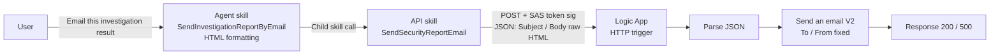
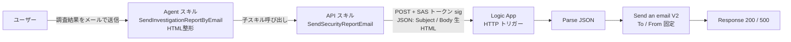

# Security Report Email Sender Plugin

> **Languages:** [English](#english) | [日本語](#日本語)

---

<a id="english"></a>

# English

This is a test program that uses an API plugin to trigger a webhook from Security Copilot. If your goal is to trigger a Logic App from Security Copilot, it’s easier to use the Logic App plugin.
An **agent** that formats Security Copilot investigation results as an HTML email and sends them to an external address via an Azure Logic App (Webhook). On the Security Copilot side it runs as an agent (GPT) that formats the result as HTML and then calls an API child skill to invoke the Logic App. The HTML is passed as-is (without URL encoding) in the JSON body.

## Architecture



| Item | Detail |
|------|--------|
| Security Copilot side | **Agent** (standard agent). The Agent skill `SendInvestigationReportByEmail` orchestrates HTML formatting and delivery |
| Child skill | API skill `SendSecurityReportEmail` (invokes the Logic App webhook) |
| Email delivery | Office 365 Outlook connector's `Send an email (V2)` action |
| Trigger (Logic App) | HTTP Request (Webhook), protected by a SAS signature (`sig`) |
| Auth (API → Logic App) | SAS token. `sig` is appended via ApiKey (QueryParams); `api-version` / `sp` / `sv` are sent as fixed single-value enums in the OpenAPI spec. OAuth 2.0 support planned |
| Recipient (To) / Sender (From) | Fixed on the Logic App side (ARM parameters `mailTo` / `mailFrom`) |
| Message | `Subject` / `Body` passed as JSON. `Body` is passed as raw HTML (without URL encoding) |

## Files

| File | Description |
|------|-------------|
| `SecurityReportEmailSender_ja.yaml` | Security Copilot agent manifest — **Japanese** (Agent skill + API child skill) |
| `SecurityReportEmailSender_en.yaml` | Security Copilot agent manifest — **English** |
| `openapi_email_sender.yaml` | OpenAPI spec for the API child skill (`SendSecurityReportEmail`) — **Japanese descriptions**. Includes the real region host / workflow GUID |
| `openapi_email_sender_en.yaml` | OpenAPI spec — **English descriptions**. Includes the real region host / workflow GUID |
| `SecurityReportEmailSender_LogicApp.json` | ARM template for the Logic App (Consumption) + Office 365 connection — **Japanese** metadata |
| `SecurityReportEmailSender_LogicApp_en.json` | ARM template — **English** metadata |
| `.gitignore` | Generic hygiene to avoid accidentally committing secrets (`.env` / `*.secret*` / `*.local.*`). The SAS `sig` is never stored in any file |
| `SecurityReportEmailSender_card.html` | Plugin card (visual summary) — **English** |
| `SecurityReportEmailSender_ja_card.html` | Plugin card (visual summary) — **Japanese** |

> **Note: Managed Identity and `Send an email (V2)`**
> The original spec mixed "grant email delivery permission via Managed Identity" with "use the `sendmail(v2)` action," but the two are technically incompatible. `Send an email (V2)` is an Office 365 Outlook connector action and uses an API connection (OAuth sign-in), not Managed Identity.
> Anticipating a future migration to Power Automate, the highly portable **Office 365 Outlook connector approach** was adopted (Managed Identity is not available in Power Automate). Least privilege is ensured by authorizing the connection with a **send-only service account (shared mailbox)**.

## Deployment Steps

### 1. Deploy the Logic App

```powershell
$rg = "rg-securitycopilot"
$location = "japaneast"

# Create the resource group (if not already created)
az group create --name $rg --location $location

# Deploy the ARM template (use the _en.json template; _ja and _en are identical except metadata language)
az deployment group create `
  --resource-group $rg `
  --template-file .\SecurityReportEmailSender_LogicApp_en.json `
  --parameters `
    logicAppName=SecurityReportEmailSender `
    location=$location `
    mailTo="soc-report@contoso.com" `
    mailFrom="security-noreply@contoso.com"
```

### 2. Authorize the Office 365 connection

The ARM template creates the connection resource, but OAuth authorization must be done manually.

1. Open the Logic App in the Azure Portal.
2. Open the **API connection** (`office365-securityreport`) and sign in from **General > Authorize this API**.
3. Sign in with a **send-only service account** (for least privilege).
4. If you specify a different address in `mailFrom`, that account must have **Send as / Send on behalf** permission on the target mailbox.

> **Important: ARM redeploy resets connection authentication**
> Because the `Microsoft.Web/connections` resource cannot contain OAuth tokens, **redeploying the ARM template clears the connection's authentication** (`Unauthenticated` / "Invalid connection"). Always redo step 2 after a redeploy.
> Also, re-authenticating in the portal's Logic App designer may **create a new connection (e.g., `office365-1`) and switch the workflow reference to it**. In that case, it works as-is provided the authenticated connection name (e.g., `office365-1`) matches the workflow's reference key.

### 3. Get the Webhook (callback) URL and SAS signature

```powershell
az rest --method post `
  --uri "https://management.azure.com/subscriptions/<SUB-ID>/resourceGroups/$rg/providers/Microsoft.Logic/workflows/SecurityReportEmailSender/triggers/manual/listCallbackUrl?api-version=2016-10-01" `
  --query "value" -o tsv
```

The retrieved callback URL has the following form. Note each value.

```
https://<REGION>.logic.azure.com/workflows/<WORKFLOW-ID>/triggers/manual/paths/invoke?api-version=2016-10-01&sp=%2Ftriggers%2Fmanual%2Frun&sv=1.0&sig=<SIGNATURE>
```

- `<REGION>` and `<WORKFLOW-ID>` → set directly in `servers.url` of `openapi_email_sender.yaml` / `openapi_email_sender_en.yaml` (real values are committed)
- `<SIGNATURE>` (the `sig` value) → enter as the API key when installing the plugin in Security Copilot
- `api-version` / `sp` / `sv` values → reflect in each query parameter's `enum` / `default` in the OpenAPI spec (defaults are fine)

> **Important: Fix the SAS parameters as single-value enums in the OpenAPI spec**
> `api-version` / `sp` / `sv` are required for SAS signature validation. Security Copilot does not send query parameters that only have a `default` value, so a `default` alone is not transmitted and results in **401 Unauthorized**. To prevent this, each parameter is made a "constant" with `required: true` and a single-value `enum` (e.g., `enum: ["1.0"]`) so it is always sent. Only `sig` is appended via ApiKey auth (QueryParams).

### 4. Publish the OpenAPI spec

The region host and workflow GUID are committed directly in the OpenAPI files (`servers.url`). The only true secret is the SAS `sig`, which is never stored in any file and is entered at plugin install time.

| File | Content | Publish |
|------|---------|---------|
| `openapi_email_sender.yaml` | OpenAPI spec with real `servers.url`, Japanese descriptions. | ✅ push |
| `openapi_email_sender_en.yaml` | OpenAPI spec with real `servers.url`, English descriptions. | ✅ push |

1. Confirm `servers.url` in `openapi_email_sender.yaml` / `openapi_email_sender_en.yaml` matches the host part (`<REGION>.logic.azure.com`) and workflow GUID (`<WORKFLOW-ID>`) of the callback URL obtained in step 3.
2. Push the file to the public repository (e.g., GitHub) so it is accessible via a raw URL.
3. Set that raw URL in the `OpenApiSpecUrl` of the manifest. The shipped manifests already point at the repository raw URLs (`.../openapi_email_sender.yaml` for `_ja`, `.../openapi_email_sender_en.yaml` for `_en`).

> **Caution:** Treat the SAS `sig` (signature) as the sensitive value and never include it in any committed file. The region host and workflow GUID alone are not sufficient to invoke the Logic App without a valid `sig`.

### 5. Install the agent in Security Copilot

1. Security Copilot > **Manage plugins** > **Custom** > **Add plugin**.
2. Upload the manifest (`SecurityReportEmailSender_en.yaml` for English, `SecurityReportEmailSender_ja.yaml` for Japanese) or specify the public URL.
3. When prompted for the **API key** during installation, enter the `sig` value obtained in step 3.
4. The **Security Report Email Sender** agent becomes enabled.

## Verification

### Smoke test with curl / PowerShell (API child skill / Logic App standalone)

Pass the HTML as-is (without URL encoding) in `Body`. Because it is sent as a JSON string, HTML tags are preserved.

```powershell
$uri = "<the full callback URL from step 3>"
$body = '{"Subject":"[TEST] Security Report","Body":"<h1>Test Report</h1><p>HTML body</p>"}'
Invoke-WebRequest -Uri $uri -Method Post `
  -ContentType "application/json; charset=utf-8" `
  -Body ([System.Text.Encoding]::UTF8.GetBytes($body))
```

Checkpoints:
- HTTP 200 with `{"status":"success", ...}` is returned.
- The HTML renders correctly in the received email.

### Running from the Security Copilot agent

Following the output of an investigation session, invoke the agent inline.

```
Email the investigation result above using SendInvestigationReportByEmail
```

The agent formats the investigation result as HTML, calls the `SendSecurityReportEmail` child skill, and reports the delivery result.

## About HTML body handling

- The HTML in `Body` is passed **as-is, without URL encoding** in the JSON body. Because it is sent as a JSON string, HTML tags (such as `<h1>`) are preserved.
- The Logic App side also performs no decoding; it passes the `Parse JSON` result directly to the `Send an email (V2)` body.
- A previous configuration used URL encoding + `decodeUriComponent()` for decoding, but it was removed as unnecessary and a potential source of failures.

## Future extension: OAuth 2.0 authentication

It currently uses SAS token authentication. To switch to OAuth 2.0 in the future, the following configuration is envisioned.

1. Place **Azure API Management** or **App Service Easy Auth (Entra)** in front of the Logic App and protect it with a Bearer token.
2. Change `Authorization` in `SecurityReportEmailSender_ja.yaml` to `OAuthAuthorizationCodeFlow` (a template is included as a comment in the manifest).
3. Register an enterprise application in Entra and add the callback URI `https://securitycopilot.microsoft.com/auth/v1/callback`.

## Future extension: Migration to Power Automate

`Send an email (V2)` and the HTTP trigger are common to both Logic Apps and Power Automate. SAS token authentication can also be used as-is, so when rebuilding the flow in Power Automate, the email delivery logic and the Security Copilot agent / API child skill can be reused almost without change. The API plugin format is maintained with this migration in mind.

## Troubleshooting

| Symptom | Cause | Resolution |
|---------|-------|------------|
| `401 Unauthorized` (when running the agent) | `api-version` / `sp` / `sv` not sent, so SAS signature validation fails. Or `sig` missing/incorrect | Make each query parameter a constant with a single-value `enum` + `required` in the OpenAPI spec. Re-enter `sig` in the plugin settings |
| "Required capability is unavailable" / skill not invoked | The spec is invalid (e.g., a query string `?...` in the OpenAPI `paths` key), so the skill is not registered | Keep `paths` to just `/invoke` and define queries under `parameters`. After fixing, re-push the public URL and reload the plugin |
| `500` + `content was not a valid JSON` | The Office 365 connection is unauthenticated (`Unauthenticated`) | Re-authenticate the connection in the portal (step 2). Verify the connection name matches the workflow reference key |
| HTML tags shown as literal text | Email client display issue (the send itself succeeds) | Check the recipient's display settings |

---

<a id="日本語"></a>

# 日本語
これはSecurity CopilotからAPIプラグインを用いてWebHookを呼び出す検証用のプログラムです。Security CopilotからLogicAppを呼び出すのが目的であればLogicApp Pluginを使うほうが簡単にできます。
Security Copilot の調査結果を HTML メールに整形し、Azure Logic App (Webhook) 経由で外部のメールアドレスに送信する **エージェント** です。Security Copilot 側はエージェント (GPT) として動作し、調査結果を HTML に整形してから API 子スキルで Logic App を呼び出します。HTML はそのまま (URL エンコードせずに) JSON ボディで受け渡します。

## 構成



| 項目 | 内容 |
|------|------|
| Security Copilot 側 | **Agent** (標準エージェント)。Agent スキル `SendInvestigationReportByEmail` が HTML 整形・送信をオーケストレート |
| 子スキル | API スキル `SendSecurityReportEmail` (Logic App の Webhook を呼び出す) |
| メール送信 | Office 365 Outlook コネクタの `Send an email (V2)` アクション |
| トリガー (Logic App) | HTTP Request (Webhook)、SAS 署名 (`sig`) で保護 |
| 認証 (API→Logic App) | SAS トークン。`sig` を ApiKey (QueryParams) で付与し、`api-version` / `sp` / `sv` は OpenAPI の単一値 enum で固定送信。将来 OAuth 2.0 対応予定 |
| 宛先 (To) / 送信元 (From) | Logic App 側で固定 (ARM パラメータ `mailTo` / `mailFrom`) |
| メッセージ | `Subject` / `Body` を JSON で受け渡し。`Body` は HTML をそのまま (URL エンコードせずに) 渡す |

## ファイル

| ファイル | 説明 |
|----------|------|
| `SecurityReportEmailSender_ja.yaml` | Security Copilot エージェントのマニフェスト — **日本語** (Agent スキル + API 子スキル) |
| `SecurityReportEmailSender_en.yaml` | Security Copilot エージェントのマニフェスト — **英語** |
| `openapi_email_sender.yaml` | API 子スキル (`SendSecurityReportEmail`) の OpenAPI 仕様 — **日本語記述**。実リージョンホスト / ワークフロー GUID を含む |
| `openapi_email_sender_en.yaml` | OpenAPI 仕様 — **英語記述**。実リージョンホスト / ワークフロー GUID を含む |
| `SecurityReportEmailSender_LogicApp.json` | Logic App (Consumption) + Office 365 コネクションの ARM テンプレート — **日本語** メタデータ |
| `SecurityReportEmailSender_LogicApp_en.json` | ARM テンプレート — **英語** メタデータ |
| `.gitignore` | シークレット誤コミット防止用の汎用ルール (`.env` / `*.secret*` / `*.local.*`)。SAS の `sig` はどのファイルにも保存しない |
| `SecurityReportEmailSender_card.html` | プラグインカード (視覚的サマリ) — **英語** |
| `SecurityReportEmailSender_ja_card.html` | プラグインカード (視覚的サマリ) — **日本語** |

> **メモ: Managed Identity と `Send an email (V2)` について**
> 当初の仕様では「Managed Identity でメール配信権限を付与」と「`sendmail(v2)` アクションの使用」が併記されていましたが、両者は技術的に両立しません。`Send an email (V2)` は Office 365 Outlook コネクタのアクションで、Managed Identity ではなく API コネクション (OAuth サインイン) を使用します。
> 将来 Power Automate への移行を見据え、移植性の高い **Office 365 Outlook コネクタ方式** を採用しました (Managed Identity は Power Automate では使えないため)。最小権限は、コネクションを **送信専用のサービスアカウント (共有メールボックス)** で認可することで担保します。

## デプロイ手順

### 1. Logic App をデプロイ

```powershell
$rg = "rg-securitycopilot"
$location = "japaneast"

# リソースグループ作成 (未作成の場合)
az group create --name $rg --location $location

# ARM テンプレートをデプロイ (_en.json を使用。_ja と _en はメタデータの言語以外は同一)
az deployment group create `
  --resource-group $rg `
  --template-file .\SecurityReportEmailSender_LogicApp_en.json `
  --parameters `
    logicAppName=SecurityReportEmailSender `
    location=$location `
    mailTo="soc-report@contoso.com" `
    mailFrom="security-noreply@contoso.com"
```

### 2. Office 365 コネクションを認可

ARM テンプレートはコネクション リソースを作成しますが、OAuth 認可は手動で行う必要があります。

1. Azure Portal で Logic App を開く。
2. **API 接続** (`office365-securityreport`) を開き、**全般 > このAPIを承認** からサインイン。
3. **送信専用のサービスアカウント** でサインインすること (最小権限のため)。
4. `mailFrom` に別アドレスを指定する場合、そのアカウントが対象メールボックスへの **Send as / Send on behalf** 権限を持っている必要があります。
> **重要: ARM 再デプロイで接続認証がリセットされる**
> `Microsoft.Web/connections` リソースには OAuth トークンを含められないため、ARM テンプレートを **再デプロイすると接続の認証が消えます** (`Unauthenticated` / 「Invalid connection」)。再デプロイ後は必ずこの手順 2 をやり直してください。
> また、ポータルの Logic App デザイナーで再認証すると `office365-1` のような **新しい接続が作成され、ワークフローの参照先もそちらに切り替わる** ことがあります。その場合は、認証済みの接続名 (例: `office365-1`) とワークフローの参照キーが一致していればそのまま動作します。
### 3. Webhook (callback) URL と SAS 署名を取得

```powershell
az rest --method post `
  --uri "https://management.azure.com/subscriptions/<SUB-ID>/resourceGroups/$rg/providers/Microsoft.Logic/workflows/SecurityReportEmailSender/triggers/manual/listCallbackUrl?api-version=2016-10-01" `
  --query "value" -o tsv
```

取得した callback URL は次の形式です。各値を控えておきます。

```
https://<REGION>.logic.azure.com/workflows/<WORKFLOW-ID>/triggers/manual/paths/invoke?api-version=2016-10-01&sp=%2Ftriggers%2Fmanual%2Frun&sv=1.0&sig=<SIGNATURE>
```

- `<REGION>` と `<WORKFLOW-ID>` → `openapi_email_sender.yaml` / `openapi_email_sender_en.yaml` の `servers.url` に直接記載 (実値をコミット済み)
- `<SIGNATURE>` (`sig` の値) → Security Copilot のプラグインインストール時に API キーとして入力
- `api-version` / `sp` / `sv` の値 → OpenAPI の各クエリパラメータの `enum` / `default` に反映 (既定値のままで可)

> **重要: SAS パラメータは OpenAPI の単一値 enum で固定する**
> `api-version` / `sp` / `sv` は SAS 署名の検証に必須です。Security Copilot は OpenAPI の `default` 値のみのクエリパラメータを送信しないため、`default` だけだと送信されず **401 Unauthorized** になります。これを防ぐため、各パラメータを `required: true` かつ単一値の `enum` (例: `enum: ["1.0"]`) として「定数」化し、必ず送信されるようにしています。`sig` のみを ApiKey 認証 (QueryParams) で付与します。

### 4. OpenAPI 仕様を公開

リージョンホストとワークフロー GUID は OpenAPI ファイル (`servers.url`) に直接記載しています。唯一の真の機密は SAS の `sig` で、どのファイルにも保存せずプラグインインストール時に入力します。

| ファイル | 内容 | 公開 |
|------|------|------|
| `openapi_email_sender.yaml` | 実値の `servers.url`、日本語記述の OpenAPI 仕様。 | ✅ push する |
| `openapi_email_sender_en.yaml` | 実値の `servers.url`、英語記述の OpenAPI 仕様。 | ✅ push する |

1. `openapi_email_sender.yaml` / `openapi_email_sender_en.yaml` の `servers.url` が、手順3で取得した callback URL のホスト部 (`<REGION>.logic.azure.com`) とワークフロー GUID (`<WORKFLOW-ID>`) に一致していることを確認。
2. ファイルを公開リポジトリ (GitHub 等) に push し、raw URL でアクセス可能にする。
3. その raw URL をマニフェストの `OpenApiSpecUrl` に設定。同梱のマニフェストはすでにリポジトリの raw URL (`_ja` は `.../openapi_email_sender.yaml`、`_en` は `.../openapi_email_sender_en.yaml`) を指しています。

> **注意:** 機密値は SAS の `sig` (署名) で、どのコミットファイルにも含めないでください。リージョンホストとワークフロー GUID だけでは、有効な `sig` なしに Logic App を呼び出せません。

### 5. Security Copilot にエージェントをインストール

1. Security Copilot > **プラグインの管理** > **カスタム** > **プラグインの追加**。
2. マニフェスト (英語は `SecurityReportEmailSender_en.yaml`、日本語は `SecurityReportEmailSender_ja.yaml`) をアップロード (または公開 URL を指定)。
3. インストール時に **API キー** の入力を求められたら、手順 3 で取得した `sig` の値を入力。
4. エージェント **Security Report Email Sender** が有効化される。

## 動作確認

### curl / PowerShell でのスモークテスト (API 子スキル / Logic App 単体)

`Body` には HTML をそのまま (URL エンコードせずに) 渡します。JSON 文字列として送信されるため HTML タグは保持されます。

```powershell
$uri = "<手順3で取得した callback URL 全体>"
$body = '{"Subject":"[TEST] Security Report","Body":"<h1>Test Report</h1><p>HTML body</p>"}'
Invoke-WebRequest -Uri $uri -Method Post `
  -ContentType "application/json; charset=utf-8" `
  -Body ([System.Text.Encoding]::UTF8.GetBytes($body))
```

確認ポイント:
- HTTP 200 と `{"status":"success", ...}` が返ること。
- 受信メールで HTML が正しくレンダリングされること。

### Security Copilot エージェントからの実行

調査セッションの出力に続けて、エージェントをインラインで呼び出します。

```
上記の調査結果を SendInvestigationReportByEmail でメール送信して
```

エージェントが調査結果を HTML に整形し、`SendSecurityReportEmail` 子スキルを呼び出して、送信結果を報告します。

## HTML 本文の受け渡しについて

- `Body` の HTML は **URL エンコードせず、そのまま** JSON ボディで渡します。JSON 文字列として送信されるため、HTML タグ (`<h1>` など) はそのまま保持されます。
- Logic App 側もデコード処理を行わず、`Parse JSON` の結果をそのまま `Send an email (V2)` の本文に渡します。
- 以前は URL エンコード + `decodeUriComponent()` でデコードする構成でしたが、不要かつ障害の原因になり得るため撤去しました。

## 将来の拡張: OAuth 2.0 認証

現在は SAS トークン認証ですが、将来 OAuth 2.0 に切り替える場合は次の構成を想定しています。

1. Logic App の前段に **Azure API Management** または **App Service Easy Auth (Entra)** を配置し、Bearer トークンで保護。
2. `SecurityReportEmailSender_ja.yaml` の `Authorization` を `OAuthAuthorizationCodeFlow` に変更 (マニフェスト内にコメントで雛形を記載済み)。
3. Entra にエンタープライズ アプリケーションを登録し、コールバック URI `https://securitycopilot.microsoft.com/auth/v1/callback` を追加。

## 将来の拡張: Power Automate への移行

`Send an email (V2)` と HTTP トリガーは Logic Apps と Power Automate で共通です。SAS トークン認証もそのまま使えるため、フローを Power Automate に再構築する際もメール送信ロジックと、Security Copilot 側のエージェント / API 子スキルはほぼそのまま流用できます。API プラグイン形式を維持しているのも、この移行を見据えているためです。

## トラブルシューティング

| 症状 | 原因 | 対処 |
|------|------|------|
| `401 Unauthorized` (エージェント実行時) | `api-version` / `sp` / `sv` が送信されず SAS 署名検証が失敗。または `sig` 未入力/誤り | OpenAPI で各クエリパラメータを単一値 `enum` + `required` にして定数化。`sig` をプラグイン設定で再入力 |
| 「必要な機能が利用できない」 / スキルが呼ばれない | OpenAPI の `paths` キーにクエリ文字列 (`?...`) を含めるなど、スペックが不正でスキル未登録 | `paths` は `/invoke` のみにし、クエリは `parameters` で定義。修正後は公開 URL を再 push しプラグインを再読み込み |
| `500` + `content was not a valid JSON` | Office 365 接続が未認証 (`Unauthenticated`) | ポータルで接続を再認証 (手順 2)。接続名とワークフロー参照キーの一致を確認 |
| HTML タグがそのまま文字表示される | メールクライアントの表示問題 (送信自体は成功) | 受信側の表示設定を確認 |
